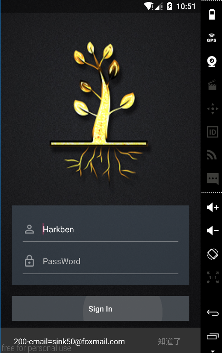
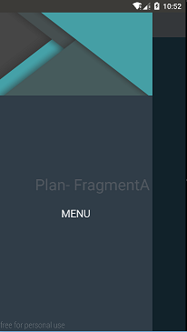
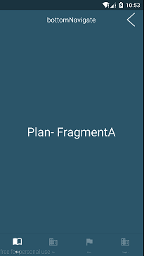
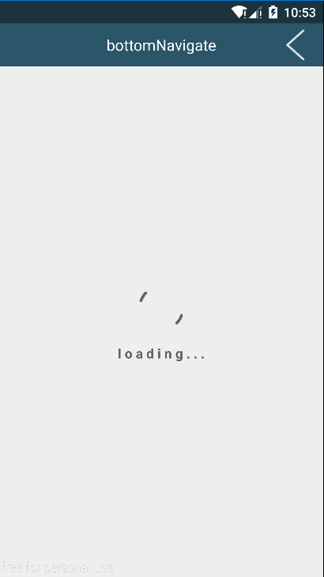

**今天不Code 明天就GG**
  <br />
 
# Rainbowlibrary
*   RainBowLibrary以一个Android 开发的简易底层库，用于快捷搭建项目，
    UI 默认实现沉浸式状态栏和MD风格，顶部TitleBa,在Activity和Fragment中显示Loding Logo。
    主题切换，语言切换。提供主流项目的导航主页，只提供内部Fragment切换管理。陆续加入Http相关封装，
    也正在学习使用 RxJava + okhttp + Retrofit

### Gradle
>
>    Step 1. 在你的根build.gradle文件中增加JitPack仓库依赖。
>    
    ```java
        allprojects {
            repositories {
              jcenter()
              maven { url "https://jitpack.io" }
            }
        }
>    
>   Step 2. 在你的model的build.gradle文件中增加RainbowLibrary依赖。
>
    ```java
    dependencies {
    	        compile 'com.github.HarkBen:RainBowLibrary:1.0.1'
    	}

### rainbowlibrary 的使用
>截图
<br />
   	         	
>
### TbaseActivity & TbaseFragment

1. **T extends TbaseActivity** 
<p>  选择使用或者不使用TbaseTitleBar ,</p> 
<p>  可以隐藏和删除，statusBar也可以删除，但都不提供重新ADD</p>
<p>  需要使用loadContentView(View v)方法设置布局，方便点再加个BaseAct 做中间层提供资源初始化和Http初始化
>
        ```java
         @Override
            public void onLayoutLoading() {
                getTitleBar().setTitleBarBackgroundColor(getResources().getColor(R.color.testmodelblue));
                setStatusColor(R.color.testmodelblue);
                getTitleBar().setLeftNormalButton(new TbaseTitleBar.OnTbaseTitleLeftViewClickListener() {
                    @Override
                    public void onClick(View v) {
                        finish();
                    }
                }).setBackgroundResource(R.mipmap.back_f);
                        //removeTBaseTitleBar();
                       // removeStatusBar();
                        loadContentView(R.layout.act_login);
                        ButterKnife.bind(this);
            }

2. **切换主题**
   * 先保存一个默认主题用来显示: 
>
>

            ```java
         SharedPUtils.saveNormalTheme(this,R.style.AppTheme,Color.BLUE);
                 switchTheme(R.style.AppTheme,Color.BLUE);
    
   * 在需要的地方切换:
>
>

          ```java
            switchTheme(R.style.AppTheme,Color.BLUE);  
            
3. **切换语言**
   * 先保存一个默认语言
>
>

        ```java
        SharedPUtils.saveLanguageSetting(this, LanguageTAG.ZH);
        
   * 切换语言
>
>        

        ```java
        switchLanguage(getResources(),LanguageTAG.FRENCH);
        ```

4. **初始加载动画**
>
>    

    ```java
            startLoadAnim();
            stopLoadAnim();
    ```

5. **Fragment切换**   
    * T extends TBaseFragmentGroupActivity
    * 使用switchFragment()
>
>    

    ```java
    public abstract class TBaseFragmentGroupActivity extends TBaseActivity {
            public TBaseFragment switchFragment(Class<?extends TBaseFragment> clazz){
                 return switchFragment(fragmentContainerId(),clazz);
            }
    }
    
    class T extends TBaseFragmentGroupActivity{
         ahBottomNavigation.setOnTabSelectedListener(new AHBottomNavigation.OnTabSelectedListener() {
                    @Override
                    public boolean onTabSelected(int position, boolean wasSelected) {
                            switchFragment(map.get(position));
                        return true;
                    }
                });
    
    }
    
    ```
           
            
        
        


 

    
   
   


